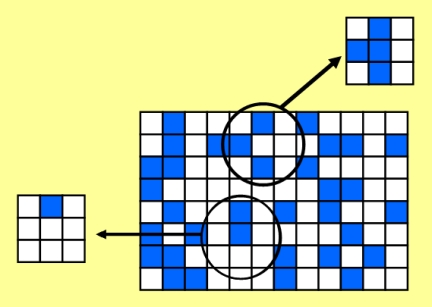

# Uma breve descrição do problema do "Jogo da Vida"

O "Jogo da Vida" é uma simulação simples desenvolvida por John Conway. No "Jogo da Vida", o domínio é uma matriz bidimensional de células, 
e cada célula pode ter um de dois estados possíveis, geralmente chamados de "viva" ou "morta". A matriz geralmente é inicializada 
com números aleatórios e o sistema evolui no tempo. Em cada etapa de tempo,
cada célula pode ou não mudar seu estado, com base no número de células vivas adjacentes, incluindo diagonais. Existem três regras:

1. Se uma célula tiver três vizinhos vivos, a célula estará viva. Se já estava vivo, permanecerá assim, e se estava morto, ficará vivo.
2. Se uma célula tiver dois vizinhos vivos, não haverá alteração na célula. Se estava morto, permanecerá morto, e se estava vivo, permanecerá vivo.
3. Em todos os outros casos - a célula estará morta. Se estava vivo, fica morto e se estava morto permanece morto.

A ideia por trás do "Jogo da Vida" é que ele simula grosseiramente populações de organismos. Os organismos precisam do 
apoio de outros organismos para viver. Se não houver uma população significativa, ou seja, zero ou um vizinho, o organismo morrerá. 
Se houver dois vizinhos, o caso é neutro, sem alteração. Se houver três vizinhos, os organismos se multiplicarão. 
Com quatro ou mais vizinhos, há superlotação e os organismos morrerão.

Um exemplo das mudanças que ocorrem para duas células em um determinado intervalo de tempo é mostrado na Figura 1
abaixo, onde as células "vivas" são azuis e as células "mortas" são brancas.

Como as células adjacentes são necessárias para determinar o novo estado de cada célula, algumas considerações especiais devem ser feitas co relação as 
condições de contorno. Por exemplo, se estivermos olhando para uma célula na extremidade esquerda do domínio, precisamos saber o estado da célula à sua esquerda para determinar seu novo estado. O problema é que não há nenhuma célula à sua esquerda, pois está na borda do domínio. Esse problema é geralmente superado pela introdução de uma borda de "células fantasmas" e pela suposição de condições de contorno periódicas. A suposição é que o domínio se repete até o infinito em todas as direções. Isso é mostrado na Figura 2.

Na Figura 2, uma grade 4x4 é mostrada para simplificar. O domínio foi repetido "lado a lado" em todas as direções. Os domínios lado a lado são mostrados em cinza e azul claro para diferenciá-los do domínio real. As células fantasmas são representadas pela borda desse domiio entorno do domínio real. Olhando para a coluna mais à esquerda do domínio real, as células fantasmas são as mesmas que as células do lado direito do domínio real. Uma configuração semelhante pode ser vista à direita, superior e inferior do domínio real.

A periodicidade funciona um pouco diferente nas esquinas. Dê uma olhada, por exemplo, na célula fantasma logo acima e à direita do domínio real. Esta célula claramente deve ser copiada da célula inferior esquerda do domínio real. Essa abordagem funciona de maneira semelhante para as outras células 
fantasmas de esquina.

Ao escrever o código, as células fantasmas são definidas em torno da borda do domínio real. No início de cada etapa de tempo, os valores apropriados  são copiados para as células fantasmas apropriadas.

