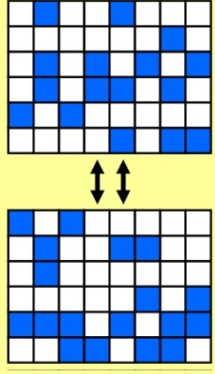
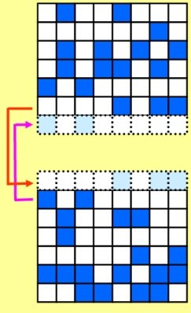

# Visão Geral

Nesta atividade, você vai ganhar familiaridade com a estrutura do programa MPI e com a comunicação ponto a ponto trabalhando com programas como "Hello, World", cálculo de %pis e o Jogo da Vida.

### Objetivos

Familiarize-se com a estrutura do programa MPI e a comunicação ponto a ponto escrevendo alguns programas MPI simples.

### Códigos-Fontes

- Hello, World: Serial C ([hello.c](hello.c))
- Envie dados para todos os processos 
- Comunicação [Ping-Pong](ping_pong.c)
- Calculo do &pi: Serial C  ([pi_serial.c](pi_serial.c))
- Game of Life: Serial C  ([game_of_life-serial.c](game_of_life-serial.c)) 
.
## Exercício 1: Rode "Hello, World"

Compile  e execute o programa "Hello, World". Certifique-se de compreender como cada processo imprime seu rank, bem como o número total de processos no comunicador MPI_COMM_WORLD.

## Exercício 2: Comunicação em Anel

Escreva um programa que, dado n processos, deve:
1. Inicializar uma variavel s com seu rank,
2. Realizar n-1 trocas de mensagens P2P obedecendo o seguinte processo:
   - Enviar o valor de s para rank + 1;
   - Receber em r o valor do rank - 1;
   - Soma em s o valor de r;

Implemennte uma versão comunicação bloqueante e outra versão não-bloqueante.

## Exercicio 3: Ping-Pong

Modique o programa [ping_pong.c](ping_pong.c) de forma que dois processos fazem pingue-pongue de um número em varias rodadas. Emcada rodada o numero é  incrementado. A comunicação encerra quando um determiando valor é atingido.

## Exercicio 4: Encontre &pi; usando método de Monte Carlo

Método de Monte Carlo é um termo utilizado para se referir a qualquer método que resolve um problema gerando números aleatórios e observando se uma dada fração desses números satisfaz uma propriedade previamente estabelecida.

Para calcular a área da circunferência unitária, utilizaremos o método de integração de Monte Carlo. A ideia é colocar a circunferência dentro de uma figura, cuja área seja fácil de calcular, e sortear pontos aleatórios dentro da figura. Utilizaremos um quadrado. Se o ponto sorteado estiver dentro da circunferência, então marcamos um acerto. Ao final dos sorteios, espera-se que a área da circunferência seja proporcional à taxa de acertos e à área do quadrado. Esse valor será uma aproximação para &pi;.

Pegue a [versão serial](pi_serial.c) do programa e modifique-a para funcionar em paralelo.

Primeiro, familiarize-se com a maneira como o programa serial funciona. 

Dica: edite NPOINTS para ter vários valores de entrada de 10 a 100000. 
O que você acha que acontecerá com a precisão quando calculamos o &pi e quando dividimos o trabalho entre os nós?

Agora paralelize o programa serial. Use apenas as seis chamadas MPI básicas.

## Exercicio 5:  "Jogo da Vida"

Veja [aqui um introdução rápida sobre o que é "Jogo da Vida"](game_of_life.md).

Para iniciar este exercício, adicione as rotinas de inicialização e finalização MPI ao código serial "Game of Life". 
Para mostrar que o código está funcionando conforme o esperado, adicione instruções para imprimir o  números de processos e o rank do processo local. 
Não se esqueça de adicionar o arquivo de cabeçalho MPI.

**Decomposição de Domínio**

Para realmente executar o programa "Jogo da Vida" em paralelo, devemos configurar a decomposição de nosso domínio, ou seja, dividir o domínio em pedaços e enviar um pedaço para cada processador. No exercício atual, nos limitaremos a dois processadores. Se você estiver escrevendo seu código em C, divida o domínio com uma linha horizontal, de forma que a metade superior seja processada em um processador e a metade inferior em um processador diferente.

Dica: Escolhemos a configuração descrita acima porque em matrizes C, as linhas são contíguas. Esta abordagem permite a especificação da localização inicial do array e o número de dados nas rotinas de envio e recebimento.

Uma questão que você precisa considerar é a dos limites do domínio interno. A Figura 1 mostra a decomposição do domínio "esquerda-direita" descrita acima. Cada célula precisa de informações de todas as células adjacentes para determinar seu novo estado. Com a decomposição do domínio, algumas das células necessárias não estão mais disponíveis no processador local. Uma maneira comum de resolver esse problema é por meio do uso de células fantasmas. No exemplo atual, uma coluna de células fantasmas é adicionada ao lado direito do domínio esquerdo e uma coluna também é adicionada ao lado esquerdo do domínio direito (mostrado na Figura 2). Após cada etapa de tempo, as células fantasmas são preenchidas, passando os dados apropriados do outro processador. Você pode querer consultar a figura na
[descrição "Jogo da Vida"](game_of_life.md) para ver como preencher as outras células fantasmas. 

Figura 1. Decomposição de Domínio.

Figura 2. Células Fantasmas.

**Desafio**

Implemente a decomposição do domínio descrita acima e adicione a passagem de mensagens às células fantasmas.

